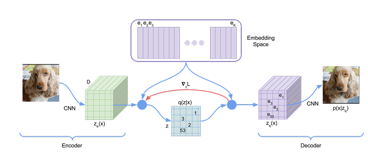
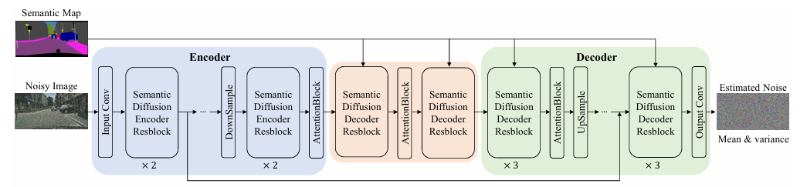

# Generazione ed Editing di Immagini sull’Inquinamento Ambientale

Progetto di Tesi Magistrale – Facoltà di Informatica, Università degli Studi di Milano-Bicocca

## 📖 Descrizione

Questo progetto ha come obiettivo lo sviluppo di un modello generativo per la creazione e modifica di immagini nel dominio dell’inquinamento ambientale.

La generazione delle immagini è condizionata da maschere semantiche, permettendo un controllo preciso sui contenuti visivi. Sono previsti sviluppi futuri per integrare funzionalità di image editing, consentendo di aggiungere o modificare elementi in immagini già esistenti.

## 🧰 Tecnologie e Metodi

- Modelli generativi basati su reti neurali (Unet + diffusion model).
- Maschere semantiche per il conditioning.
- Dataset utilizzato: TACO (Trash Annotations in Context).
- servizi di calcolo GPU in cloud come Kaggle e Google Colab.

## 📊 Dataset utilizzati

### > TACO (Trash Annotations in Context)

TACO è un dataset open-source dedicato al rilevamento e segmentazione dei rifiuti in contesto reale. È composto da immagini annotate di rifiuti raccolte in ambienti urbani e naturali, utili per applicazioni di computer vision legate all’inquinamento ambientale.

Dimensioni: 
-  Oltre 1.500 immagini ad alta risoluzione e più di 7.000 oggetti annotati.
-  3.000 immagini aggiuntive provenienti dalle annotazioni “unofficial” condivise dalla community TACO, per ampliare la varietà e robustezza del training.

Annotazioni: Fornisce segmentazioni poligonali dettagliate e bounding box, organizzate in supercategorie e classi specifiche (ad es. plastica, metallo, carta, ecc.).

Formato: Le annotazioni sono in formato COCO JSON

### > Plastopol — A Dataset for Litter Detection
Dataset progettato per rilevare “litter” (rifiuti) in vari tipi di ambiente (marino, strade, altri contesti naturali), per supportare studi e modelli automatici di rilevamento dei rifiuti.

Classe singola (one-class): tutti gli oggetti annotati appartengono alla superclasse “litter” (cioè non è diviso in categorie dettagliate come plastica, carta, metallo, etc.).

Dimensioni: 2.418 immagini, circa 5.300 istanze di “litter”.

Annotazioni: bounding box rettangolari per ogni istanza di rifiuto (“litter”).

### > Garbage Detection (Roboflow)
Dataset per il rilevamento automatico di rifiuti in vari contesti ambientali, utile per addestrare modelli di object detection.

Dimensioni: Parte del dataset originale di 10.000 immagini, selezionata per il training e la validazione.

Annotazioni: Fornisce bounding box per diverse categorie di rifiuti.

## 🛠️ Tool di Annotazione

Per la generazione delle maschere semantiche delle immagini che non presentano annotazioni utili (Plastopol dataset, Garbage Detection) è stato impiegato il tool **CVAT** (Computer Vision Annotation Tool), una piattaforma open-source per l’annotazione di immagini e video.

CVAT permette di creare annotazioni personalizzate (etichette, segmentazioni poligonali, bounding box, ecc.), supportando diversi formati di esportazione (ad es. COCO).

## 🧹 Elaborazione dataset
Il dataset finale è composto da coppie immagine–maschera semantica, ottenute unendo:

- Immagini annotate del dataset TACO.
- Sottoinsieme delle immagini dalla community TACO (unofficial annotations), in quanto molte di queste presentavano annotazioni imprecise o errate.
- Sottoinsieme delle immagini del dataset Plastopol, le cui maschere semantiche sono state generate utilizzando CVAT AI.
- Sottoinsieme delle immagini del dataset Garbage Detection (Roboflow), le cui maschere semantiche sono state generate utilizzando CVAT AI.
- Data augmentation

**📋 Caratteristiche del Dataset**

Il dataset è stato organizzato in 7 classi principali più il background:

  
  | ID  | Classe               |  
  |-----|---------------------|  
  | 0   | Background          |  
  | 1   | PLASTICA E POLIMERI |  
  | 2   | METALLI             |  
  | 3   | VETRO               |  
  | 4   | CARTA E CARTONE     |  
  | 5   | POLISTIROLO         |  
  | 6   | SIGARETTE           |  
  | 7   | NON CLASSIFICATI    |  
  

Per ridurre lo sbilanciamento tra categorie molto rappresentate (ad esempio **Plastica e Polimeri**) e quelle meno frequenti (**Sigarette**, **Polistirolo**), è stata applicata una combinazione di strategie:  
- **Campionamento bilanciato** durante la costruzione dei batch di training.  
- **Data augmentation mirata** (flip, rotazioni, traslazioni, variazione di luminosità e contrasto) soprattutto sulle classi sottorappresentate.  
- Inclusione della classe **“Non classificati”** per gestire rifiuti ambigui o non appartenenti alle categorie definite, evitando rumore eccessivo nelle altre categorie.  

Queste scelte hanno permesso di mantenere una distribuzione più equilibrata e migliorare la capacità del modello di generalizzare su classi meno comuni.  

**📂 Dataset risultante**
- Train set: 5443 campioni
- Validation set: 853 campioni

## 🧠 Architettura del Modello

Per questo progetto è stato adottato un Latent Diffusion Model (LDM), scelto per la sua capacità di processare immagini ad alta risoluzione lavorando nello spazio latente invece che direttamente nello spazio dei pixel, riducendo così il costo computazionale e migliorando l’efficienza.

Il modello è quindi composto di due macro-componenti principali:

1️⃣ **VQ-VAE Encoder–Decoder**

Un Vector Quantized Variational Autoencoder (VQ-VAE) è stato scelto come componente di compressione e ricostruzione per lavorare nello spazio latente.

- Compressione efficiente: riduce la dimensionalità delle immagini originali mappandole in uno spazio latente discreto, mantenendo le informazioni semantiche chiave.
- Quantizzazione vettoriale: utilizza un codebook di vettori latenti discreti per rappresentare in modo compatto i pattern visivi. Questa quantizzazione stabilizza il training e limita il rumore.
- Decoder: a partire dai vettori quantizzati prodotti dal processo di diffusione, ricostruisce immagini alla risoluzione iniziale mantenendo dettagli e coerenza visiva.

2️⃣ **U-Net**

Implementa il processo di diffusione nello spazio latente ed è basata sull’architettura proposta nel paper Semantic Image Synthesis via Diffusion Models (Weil Wang et al.).

- Struttura Encoder–Decoder con Skip Connections
- ResBlock con Condizionamento SPADE (Spatially-Adaptive Normalization): nei ResBlocks le norm layers vengono sostituite da SPADE, che inietta informazioni semantiche sulle feature map nello spazio latente; questo consente un controllo fine sul contenuto generato.
Il condizionamento è applicato a più livelli della rete per mantenere la coerenza semantica sia nelle feature globali che nei dettagli locali.

La rete opera nello spazio latente compresso dal VQ-VAE, riducendo significativamente i costi computazionali.

**🔗 Flusso Operativo**

L’immagine di input viene compressa nel latente tramite il VQ-VAE encoder.

La U-Net esegue il processo di diffusione nello spazio latente per generare o modificare le rappresentazioni.

Il VQ-VAE decoder ricostruisce l’immagine ad alta risoluzione dallo spazio latente elaborato.

## ⚙️ Training del VQ-VAE

Come già anticipato, l'architettura VQ-VAE utilizza un codebook per mappare l’input in uno spazio latente discreto.

La loss function utilizzata per l'addestramento è composta da diversi componenti: 

- **Reconstruction loss:** misura la differenza tra l’immagine originale e quella ricostruita dal decoder. Garantisce che l’encoder-decoder mantenga la struttura generale dell’immagine.
  
- **Codebook loss:** L2 loss applicata ai vettori del codebook per avvicinarli agli output dell’encoder. Permette di aggiornare i vettori latenti discreti e mantenere la coerenza del dizionario.
  
- **Commitment loss:** forza l’encoder a scegliere i vettori del codebook corretti e previene fluttuazioni tra diversi code vectors, aumentando la stabilità del training.

Al fine di ovviare ai problemi di sfuocatura e migliorare la qualità visiva delle ricostruzioni, sono stati aggiunti due termini alla loss:

- **Perceptual loss:** confronta le feature di alto livello delle immagini ricostruite con quelle originali, estratte tramite VGG16, permettendo al decoder di generare immagini più vicine alla percezione visiva dell’originale.

- **Adversarial loss:** utilizza un discriminatore per spingere il decoder a produrre immagini indistinguibili da quelle reali.
  
  Questo termine entra in gioco solo dopo un certo numero di training steps, in modo da permettere all’encoder di imparare prima le ricostruzioni base e non ostacolare il miglioramento iniziale del decoder.

**📈 Valutazione**

Per monitorare le prestazioni del VQ-VAE e verificare la qualità delle immagini ricostruite, sono state utilizzate tre metriche complementari: FID, PSNR e SSIM. 
Queste permettono di valutare sia la qualità visiva percepita che la fedeltà numerica (a livello di pixel) delle ricostruzioni.

- **Fréchet Inception Distance (FID)**
  
  La FID confronta la distribuzione delle feature delle immagini ricostruite con quelle originali, calcolate usando *Inception v3*, pre-addestrato su ImageNet, fornendo una misura percettiva globale.
  
  $
  \text{FID} = \|\mu_r - \mu_g\|^2 + \text{Tr}\left(\Sigma_r + \Sigma_g - 2(\Sigma_r \Sigma_g)^{1/2}\right)
  $
  
- **Peak Signal-to-Noise Ratio (PSNR)**

  PSNR confronta la differenza pixel-per-pixel tra le due immagini (MSE) valutando la qualità dell'immagine ricostruita, utile per verificare che il VQ-VAE mantenga dettagli locali e riduca artefatti evidenti.

  $\text{PSNR} = 20 \cdot \log_{10}\left(\frac{\text{MAX}_I}{\sqrt{\text{MSE}}}\right)$

- **Structural Similarity Index Measure (SSIM)**

  Confronta le immagini in termini di luminosità, contrasto e struttura locale, fornendo una valutazione sulla somiglianza strutturale percepita
    
    $\text{SSIM}(x,y) = \frac{(2\mu_x\mu_y + C_1)(2\sigma_{xy} + C_2)}{(\mu_x^2 + \mu_y^2 + C_1)(\sigma_x^2 + \sigma_y^2 + C_2)}$

Queste metriche permettono di monitorare sia che le ricostruzioni siano visivamente convincenti, sia che esse siano strutturalmente corrette e statisticamente coerenti con i dati originali.